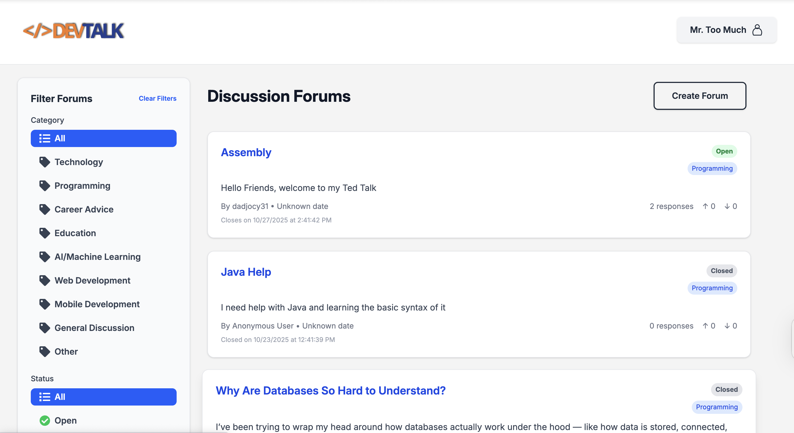

# Capstone: AI Forum Voting App

## The team
- Tyran
- Nicole
- Devyn
- Jayden

## Screenshot


## A description of the app
- A full-stack web application where users create accounts, start forums based on questions or problems, vote on responses, and view AI-generated summaries after forums close.
- Users can register, log in, post anonymously, create/join forums, upvote/downvote responses, and view AI summaries.
- Admins can manage forums and moderate content.
- Core features:
  - Forum creation and participation
  - Voting on responses
  - AI-powered summary and action roadmap after forum closure
  - Authentication (user and admin)
- Key technologies:
  - React, React Router, TypeScript, Vite, TailwindCSS
  - Firebase (Firestore, Auth)
  - OpenAI API for AI summaries
  - Jest, Testing Library for tests
  - Hosted on Vercel

## Demo link
- https://capstoneproject-chi.vercel.app

## Installation instructions
- Prerequisites: Node.js, npm, Firebase project and keys
- Clone the repo and install dependencies:
  ```sh
  npm install
  ```
- Set up environment variables in `.env.local` (see Firebase and OpenAI keys)
- Start development server:
  ```sh
  npm run dev
  ```
- Build for production:
  ```sh
  npm run build
  ```
- Run tests:
  ```sh
  npm test
  ```

## Known issues
- User saving between sessions and pages
- Anonymous Mode
- Account Logout
- Account Login
- Account Registration
- User Registration
- Show Home Page With Forums Listed And Ability To Login
- Showing Invisible Name For Anonymous
- Revisit Forums To See Messages And Results
- Creating Forum With Desired Requirements
- Saving Accounts On Firebase
- Skeleton Of An Account
- Name Of App/Website?
- UI For Forum Page
- Show End Results In Forum from OpenAI
- Upvote/downvote Forums (UI Only)
- List Messages In Forum
- Forum Template/Showing (title, description, author)
- Give Suggestions From OpenAI Prompt Data
- Give A Summary Using OpenAI From Result
- Result Encompasses Forum, Voting, and Messages Data
- Upvoting/Downvoting Responsiveness
- Realtime Updates
- Give Feedback to Message
- User Receives Messages To Forum

## Roadmap features
- Showing Invisible Name For Anonymous
- Account Logout
- UI For Forum Page
- User Receives Messages To Forum
- User saving between sessions and pages
- Revisit Forums To See Messages And Results
- Upvoting/Downvoting Responsiveness
- Users Send Messages To Forum
- Skeleton Of An Account
- Upvote/downvote Forums (UI Only)
- Skeleton For OpenAI
- Realtime Updates
- Name Of App/Website?
- Edit/Delete Feature For Admins
- Show Home Page With Forums Listed And Ability To Login
- Skeleton For Messaging
- Forum Template/Showing (title, description, author)
- User Registration
- Saving Accounts On Firebase
- Result Encompasses Forum, Voting, and Messages Data
- Account Login
- Creating Forum With Desired Requirements
- Give A Summary Using OpenAI From Result

## Credits
- Team: Tyran, Nicole, Devyn, Jayden
- Libraries: [React](https://react.dev/), [React Router](https://reactrouter.com/), [Firebase](https://firebase.google.com/), [OpenAI](https://platform.openai.com/), [TailwindCSS](https://tailwindcss.com/), [Jest](https://jestjs.io/)
- APIs: OpenAI, Firebase
- TODO: Add dataset/icon/template credits if used
