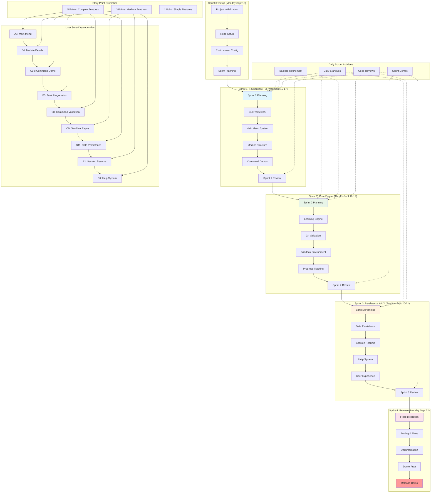

# Git Training CLI Application - User Stories and Sprint Planning

## Product Vision
A command-line interface application that teaches Git and GitHub fundamentals through interactive learning modules, practical command execution, and progressive skill development in a controlled environment.

## Product Backlog by Epic

### EPIC A: Core Navigation and User Interface
- **A1**: As a user, I want to launch the application and view a list of available learning modules with their respective difficulty levels and completion status.
- **A2**: As a user, I want to resume my previous session and continue from where I left off in my learning progression.
- **A3**: As a user, I want to access configuration options to customize the learning experience including difficulty filters and display preferences.

### EPIC B: Learning Module Structure and Progression
- **B4**: As a user, I want to view detailed information about each learning module including objectives, required commands, and expected outcomes.
- **B5**: As a user, I want to progress through structured learning tasks with clear completion indicators and progress tracking.
- **B6**: As a user, I want to access contextual help and hints when encountering difficulties during task execution.
- **B7**: As a user, I want to earn experience points, achieve skill levels, and unlock achievement badges to track my learning progress.

### EPIC C: Command Validation and Git Integration
- **C8**: As a user, I want the application to validate my Git command execution in real-time to ensure proper learning and immediate feedback.
- **C9**: As a user, I want to work within isolated sandbox repositories for each learning module to practice commands safely.
- **C10**: As a user, I want to view command demonstrations and examples before attempting to execute them independently.

### EPIC D: Data Persistence and Session Management
- **D11**: As a user, I want my learning progress automatically saved locally to maintain continuity across sessions .

### EPIC E: Content Management and Authoring
- **E13**: As a content author, I want to define learning modules using structured configuration files (JSON) for maintainability.
- **E14**: As a content author, I want to create reusable validation components that can be shared across multiple learning modules.

## Definition of Done (Adjusted for One-Week Timeline)
- Feature implementation completed and basic functionality verified
- Core functionality manually tested and validated
- Basic documentation updated (CLI help, README with usage examples)
- Code committed to main branch
- Application can be launched and demonstrates key learning features

## Scrum Sprint Planning and Delivery Strategy
**Project Timeline**: September 15-22, 2025 (Due: Monday, September 22)
**Sprint Duration**: 2 days each | **Team Capacity**: Adjusted for academic project timeline

### Sprint 0: Project Setup (Monday, September 15)
**Sprint Goal**: Initialize development environment and project structure
**Duration**: 1 day (preparation day)

**Sprint Tasks**:
- Repository setup and team access configuration
- Development environment standardization
- Initial project structure creation
- Sprint planning and task estimation

**Deliverables**:
- Git repository with initial structure
- Development environment documentation
- Sprint backlog refined and estimated

---

### Sprint 1: Foundation & CLI Framework (Tuesday-Wednesday, Sept 16-17)
**Sprint Goal**: Establish core CLI application with basic navigation and module structure
**Duration**: 2 days | **Story Points**: 13

**User Stories**:
- **A1** (5 pts): As a user, I want to launch the application and view a list of available learning modules with their respective difficulty levels and completion status
- **B4** (3 pts): As a user, I want to view detailed information about each learning module including objectives, required commands, and expected outcomes
- **C10** (5 pts): As a user, I want to view command demonstrations and examples before attempting to execute them independently

**Sprint Tasks**:
- Set up Node.js CLI framework (Commander.js/Inquirer.js)
- Create main menu system with interactive navigation
- Implement module listing with hardcoded Git learning modules
- Build command demonstration system (show examples)
- Design module detail view with learning objectives

**Definition of Done**:
- User can launch CLI application successfully
- Main menu displays 3 predefined Git learning modules
- User can navigate to module details and view objectives
- Command demonstrations display clearly formatted examples
- Code is committed to main branch with basic documentation

**Sprint Review Criteria**:
- Demo: Launch app, navigate menus, view module details
- All acceptance criteria met for stories A1, B4, C10

---

### Sprint 2: Learning Engine & Git Integration (Thursday-Friday, Sept 18-19)
**Sprint Goal**: Implement core learning workflow with Git command validation and sandbox environments
**Duration**: 2 days | **Story Points**: 13

**User Stories**:
- **B5** (5 pts): As a user, I want to progress through structured learning tasks with clear completion indicators and progress tracking
- **C8** (5 pts): As a user, I want the application to validate my Git command execution in real-time to ensure proper learning and immediate feedback
- **C9** (3 pts): As a user, I want to work within isolated sandbox repositories for each learning module to practice commands safely

**Sprint Tasks**:
- Implement task progression engine with step-by-step workflow
- Build Git command parser and basic validation system
- Create sandbox repository management (temp directories)
- Add progress tracking with completion indicators
- Implement real-time command feedback system

**Definition of Done**:
- Users can complete at least one full Git learning module
- Git commands are validated in isolated sandbox environments
- Progress is tracked and displayed throughout module completion
- Error handling provides clear feedback for invalid commands
- All Git operations work safely in temporary directories

**Sprint Review Criteria**:
- Demo: Complete "Git Basics" module end-to-end
- Validate that Git commands work in sandbox environment
- Show progress tracking and completion indicators

---

### Sprint 3: Data Persistence & User Experience (Saturday-Sunday, Sept 20-21)
**Sprint Goal**: Add session management, data persistence, and enhanced user experience features
**Duration**: 2 days | **Story Points**: 11

**User Stories**:
- **D11** (5 pts): As a user, I want my learning progress automatically saved locally to maintain continuity across sessions
- **A2** (3 pts): As a user, I want to resume my previous session and continue from where I left off in my learning progression
- **B6** (3 pts): As a user, I want to access contextual help and hints when encountering difficulties during task execution

**Sprint Tasks**:
- Implement JSON-based progress persistence system
- Add session resume functionality with state restoration
- Create contextual help system with command hints
- Enhance user interface with better messaging and guidance
- Add basic achievement system (completion badges)

**Definition of Done**:
- Progress automatically saves after each completed task
- Users can exit and resume sessions seamlessly
- Help system provides relevant hints based on current context
- User experience feels polished with clear guidance
- Achievement badges display for completed modules

**Sprint Review Criteria**:
- Demo: Complete partial module, exit, restart, and resume
- Show help system providing contextual assistance
- Display achievement badges for completed work

---

### Sprint 4: Final Integration & Release Preparation (Monday, Sept 22)
**Sprint Goal**: Final testing, documentation, and release preparation
**Duration**: 1 day | **Release Day**

**Final Sprint Tasks**:
- Integration testing and critical bug fixes
- Complete documentation (README, CLI help, usage guide)
- Final UI/UX polish and error message improvements
- Demo preparation and presentation materials
- Release package preparation

**Release Deliverables**:
- Working CLI application with 3 Git learning modules
- Complete user documentation and installation guide
- Demo presentation ready
- Source code with proper documentation
- Release notes and known issues list

**Final Acceptance Criteria**:
- Application demonstrates all core user stories
- Documentation allows new users to install and use the application
- No critical bugs that prevent core functionality
- Demo successfully showcases learning workflow

### MVP Learning Modules (Implemented Across Sprints)
1. **Git Basics** (Sprint 1-2): `git init`, `git add`, `git commit`
2. **Working with Changes** (Sprint 2): `git status`, `git diff`, `git log`
3. **Branching Fundamentals** (Sprint 3): `git branch`, `git checkout`, `git merge`

### Sprint Retrospectives and Continuous Improvement
**After Each Sprint**:
- Sprint Review: Demo completed user stories to stakeholders
- Sprint Retrospective: Team reflection on what worked, what didn't, improvements
- Velocity tracking: Monitor story points completed vs. planned
- Risk assessment: Identify blockers and mitigation strategies for next sprint

### Future Enhancements (Product Backlog for Future Releases)
**Post-MVP Features** (Prioritized by Business Value):
- **A3**: Advanced configuration options and user preferences
- **B7**: Complex achievement and gamification systems
- **D12**: Progress export/import functionality
- **E13**: External module definition files (JSON/YAML)
- **E14**: Reusable validation components
- **F15**: Detailed analytics and progress reporting
- **F16**: Feedback and rating systems
- **G17**: Advanced accessibility features

### Daily Scrum Framework
**Daily Standup Structure** (15 minutes max):
1. **What did I accomplish yesterday?**
2. **What will I work on today?**
3. **Are there any impediments or blockers?**

**Sprint Planning Process**:
- Sprint Goal definition
- User story estimation using Planning Poker
- Sprint capacity vs. velocity assessment
- Task breakdown and assignment
- Definition of Done agreement

### Risk Mitigation for Agile Timeline
- **Scope Risk**: Clearly defined MVP with "nice-to-have" features identified for deferral
- **Technical Risk**: Use proven frameworks and libraries to minimize implementation risk
- **Team Risk**: Pair programming for knowledge sharing, daily standups for communication
- **Quality Risk**: Continuous integration of features, sprint reviews for early feedback
- **Timeline Risk**: 2-day sprint cycles allow for quick course correction and re-prioritization

## Scrum Process Flow and Sprint Dependencies

## Technical Architecture and Implementation Strategy (One-Week Focus)

### Architecture Decisions (Optimized for Speed)
- **Language**: Node.js with minimal dependencies for rapid development
- **CLI Framework**: Commander.js + Inquirer.js for interactive menus
- **Testing**: Manual testing with basic error handling (automated tests deferred)
- **Configuration**: Hardcoded modules initially, JSON config files for future
- **Git Integration**: Simple `child_process.exec()` calls with output parsing
- **State Management**: JSON file persistence with basic backup

### One-Week Development Stack
- **Core**: Node.js 18+ with ES modules
- **CLI Libraries**: `commander`, `inquirer`, `chalk` (for colors)
- **File Operations**: Native `fs` module with `fs/promises`
- **Git Commands**: Native git CLI via `child_process`
- **Data Storage**: JSON files in user's home directory

### Risk Mitigation (One-Week Timeline)
- **Technical Risk**: Use battle-tested npm packages instead of custom implementations
  - *Mitigation*: Commander.js for CLI, Inquirer.js for interactions
- **Scope Creep Risk**: Strict feature prioritization with MVP focus
  - *Mitigation*: Daily feature freeze decisions, "must-have" vs "nice-to-have" classification
- **Integration Risk**: Simple architecture with minimal dependencies
  - *Mitigation*: Monolithic structure, avoid microservices complexity
- **Time Risk**: Aggressive timeline with buffer for polish
  - *Mitigation*: Daily progress check-ins, pair programming for blockers

### Success Metrics (MVP Definition)
- **Functional**: User can complete 3 Git learning modules end-to-end
- **Educational**: Command demonstrations are clear and helpful
- **Technical**: Application starts in <3 seconds, handles errors gracefully
- **User Experience**: Intuitive navigation, clear progress indicators
- **Delivery**: Working demo ready by Monday morning with documentation
